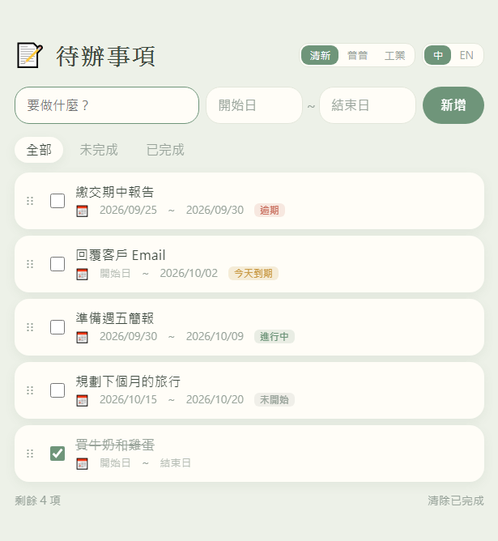
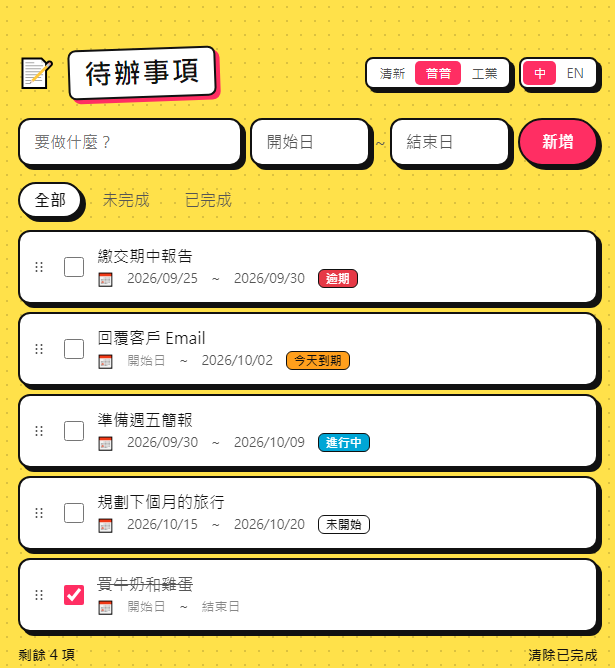
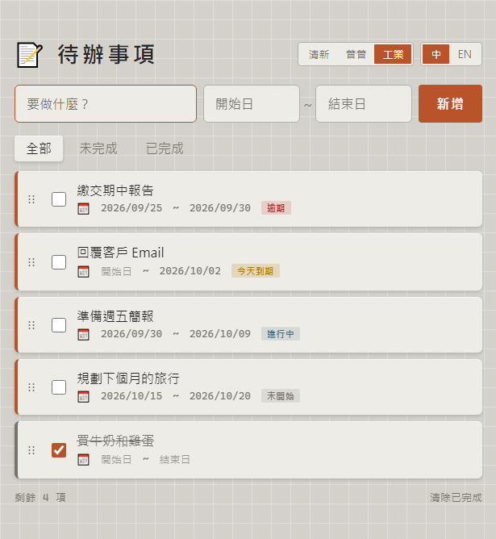

# 📝 待辦事項 To-Do List

一個簡單好用的待辦事項網頁，打開瀏覽器就能用，不用安裝、不用註冊。

**👉 線上使用：https://ywentsaitw.github.io/todo/**

## 截圖

| 清新 Fresh | 普普 Pop | 工業 Industrial |
|:---:|:---:|:---:|
|  |  |  |

## 功能

- **新增、編輯、刪除**：輸入文字按「新增」；雙擊項目文字可直接修改
- **完成勾選**：勾選後顯示刪除線，可一鍵「清除已完成」
- **篩選**：全部／未完成／已完成
- **拖曳排序**：按住項目左側的 `⋮⋮` 拖曳，滑鼠與手機觸控都可以
- **起訖日期**：可設定開始日與預定完成日（都可不填），起日晚於訖日時會自動校正
- **狀態標籤**：依日期自動顯示「逾期」、「今天到期」、「進行中」、「未開始」
- **三種主題**：清新 Fresh／普普 Pop／工業 Industrial，並支援系統深色模式
- **中英雙語**：可切換中文／English，日期格式會跟著語言改變
- **自動儲存**：資料、主題、語言設定都會記住，重新整理也不會不見

## 資料存放說明

待辦事項存在**你自己瀏覽器的 localStorage**，不會上傳到任何伺服器：

- 每個人看到的都是自己的清單，彼此不會共用
- 換電腦、換瀏覽器或清除瀏覽資料，清單就會消失

## 專案結構

```
├── index.html                       # 轉址頁，自動導向 todo-web/
├── docs/screenshots/                # README 用的截圖
└── todo-web/
    ├── index.html                   # 主程式（HTML + CSS + JavaScript 全在這一個檔案）
    └── index-layouts-backup.html    # 舊版版面備份
```

純前端單一檔案，沒有任何外部套件或建置步驟。

## 本機執行

直接用瀏覽器打開 `todo-web/index.html` 即可。

## 部署

使用 **GitHub Pages**（`main` 分支、根目錄）自動部署，`git push` 後約 1 分鐘網站就會更新。

## 授權

[MIT License](LICENSE)
